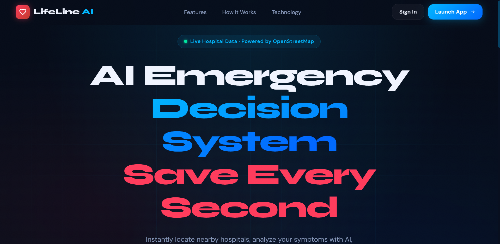
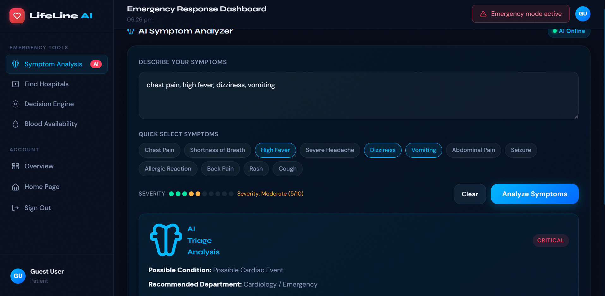
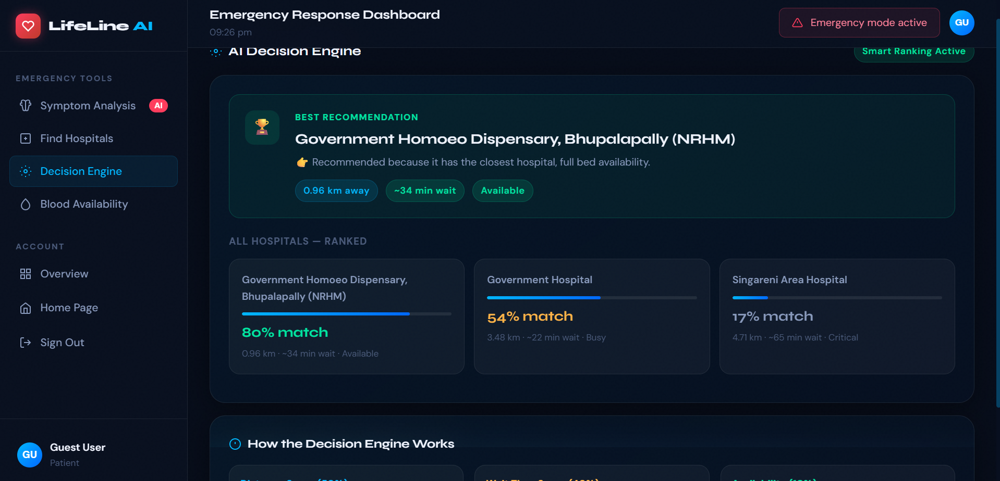
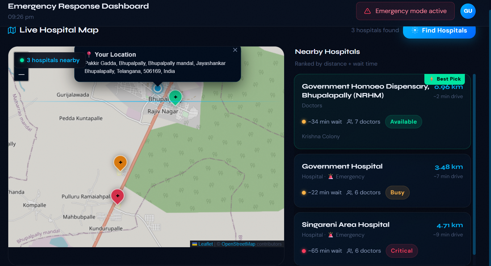
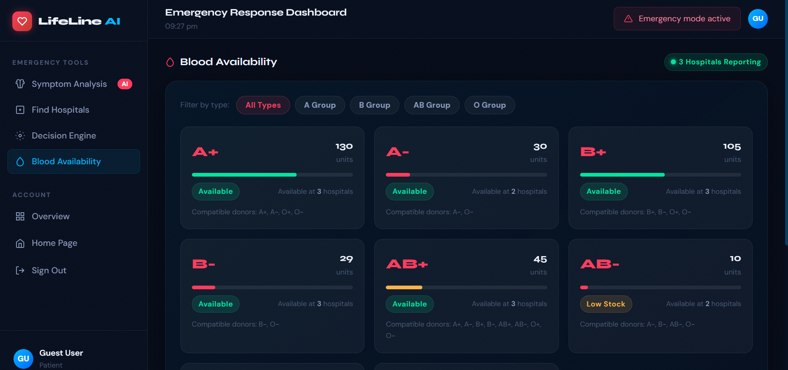

# 🚑 LifeLine AI

### Real-Time Emergency Decision Support System

> From panic → to the right medical decision in seconds.

## 🌐 Live Demo

https://shindeanjali2k6.github.io/Lifeline-AI/

## 📌 Overview

LifeLine AI helps users make faster emergency healthcare decisions by analyzing symptoms, assessing risk levels, locating nearby hospitals, and providing intelligent recommendations in real time.

## ✨ Features

* 🧠 Symptom-based risk assessment
* ⚠️ Emergency severity classification
* 📍 Nearby hospital discovery
* 🗺️ Interactive hospital map
* 🎯 Hospital recommendation engine
* 🩸 Blood availability tracking
* 📱 Responsive user interface

## 📸 Screenshots

### Home Dashboard

### Symptom Analysis AI

### Decision Engine

### Hospital Finder

### Blood Availability

## ⚙️ How It Works

1. User enters symptoms.
2. Risk level is evaluated.
3. User location is detected.
4. Nearby hospitals are fetched.
5. Best hospital recommendation is generated.
6. Blood availability information is displayed.

## 🛠️ Tech Stack

**Frontend**

* HTML
* CSS
* JavaScript

**APIs & Services**

* OpenStreetMap
* Overpass API
* Geolocation API

**Maps**

* Leaflet.js

## 🚀 Future Enhancements

* Agentic AI healthcare assistant
* Voice-based emergency support
* Ambulance tracking
* Multilingual support
* LLM-powered symptom understanding

## ⚠️ Disclaimer

LifeLine AI is a decision-support system and is not intended to replace professional medical advice or diagnosis.

## 👩‍💻 Author

Anjali Shinde

GitHub: https://github.com/ShindeAnjali2k6

